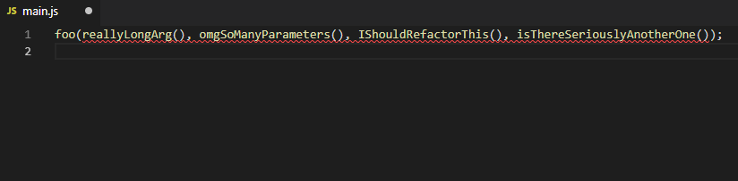

# Prettier Browser Extension

> Extension that adds support for prettifying input boxes that support Markdown or Code. Currently supports Chrome and Firefox.

## Chrome Web Store

[Install](https://chrome.google.com/webstore/detail/prettier/fbcfnmplppajblbmdehballiekfgdkhp) the extension from the store.

## Development

### Install Dependencies

```
yarn
```

### Build

For a one-time build in production:

```
yarn build
```

#### Test in Chrome locally

To watch files and rebuild when files change in development:

```
yarn dev:chrome

# or

yan dev:firefox
```

To open React devtools for the options page:

```
yarn react-devtools
```

- Chrome Settings > More Tools > Extensions...
- Turn on Developer mode
- Load unpacked > Select the `extension/chrome` directory

#### Test in Chrome locally

To watch files and rebuild when files change in development:

```
yarn build:firefox:dev
yarn launch:firefox
```

To open React devtools for the options page:

```
yarn react-devtools
```

### Lint files

```
yarn lint
```

### Format files

```
yarn format
```

### Run tests (to be added in the future)

```
yarn test-only
```

### Run all of the above

```
yarn test
```

### Help

To configure "Prettier options" via chrome:

- click on the prettier chrome extention,
  

- You will get a Popup menu among which is **"Options"**.
  
- Click on **options** and make your setups.
  
- Now Prettier is set up, and ready to be used.
  

  ## Help

We would love your [help](https://github.com/prettier/prettier-browser-extension/issues) :)
